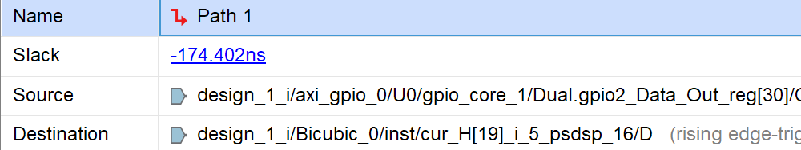
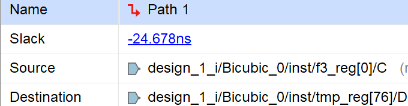
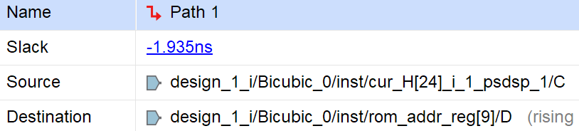
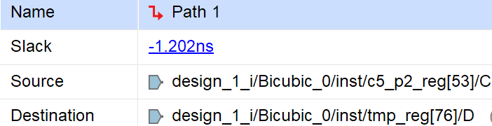
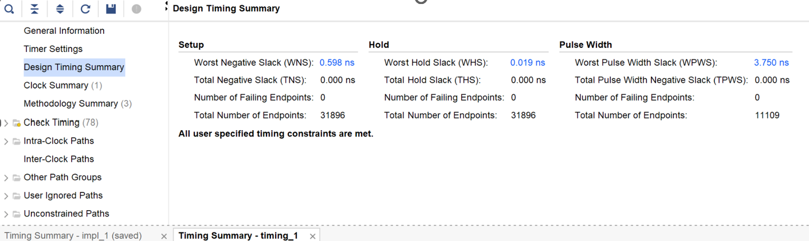
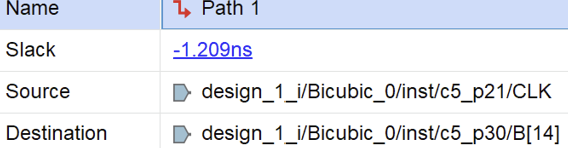
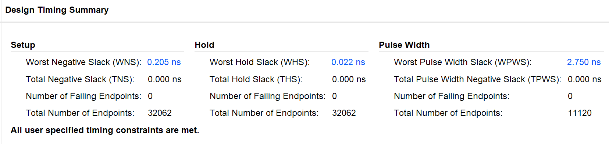
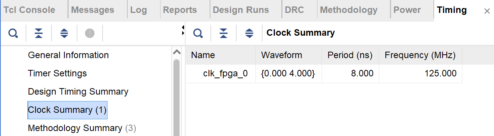

# 支援多解析度輸出之 Bicubic 影像縮放 FPGA 實作

**Multi-Resolution Bicubic Image Scaling on FPGA**

本專題以 **Verilog HDL** 實作 Bicubic Interpolation 影像縮放核心，並整合 **Python GUI、Zynq PS/PL、UART、AXI GPIO 與 BRAM**，完成影像傳輸、參數設定與硬體運算。

設計過程透過 Vivado Timing Report 分析 critical path，先在 **100 MHz** 下完成 Timing Closure，再將時脈提高至 **125 MHz**，針對新的乘法瓶頸進一步優化，最終達成 **Post-Implementation WNS = +0.205 ns**。

## Project Overview

| Item | Description |
|---|---|
| FPGA Platform | PYNQ-Z2 / Xilinx Zynq-7000 |
| RTL Design | Bicubic Interpolation implemented in Verilog HDL |
| Multi-Resolution Output | 40 × 40 / 50 × 50 / 63 × 63 |
| HW/SW Co-Design | Python GUI + UART + Zynq PS/PL + AXI GPIO + BRAM |
| Timing Optimization | Iterative Divider + Pipelining + Datapath Optimization |
| Final Clock | **125 MHz (8.000 ns period)** |
| Final WNS | **+0.205 ns** |
| Timing Closure | Setup / Hold / Pulse Width checks passed |

## System Architecture

```text
               UART
Python GUI  <--------->  Zynq PS
                             │
                ┌────────────┴────────────┐
                │                         │
            AXI GPIO                    BRAM
      Parameters / Status            Image Data
                │                         │
                └────────────┬────────────┘
                             ▼
                    Bicubic RTL Core (PL)
```

- **BRAM**：儲存輸入與輸出影像資料
- **AXI GPIO**：PS 與 PL 之間的控制參數與狀態訊號傳遞
- **UART**：負責 Python GUI 與 Zynq PS 之間的資料傳輸

## Timing Optimization

### Timing Optimization Summary

| Optimization Stage | Clock | WNS |
|---|---:|---:|
| Original RTL | 100 MHz | -174.402 ns |
| Iterative Divider | 100 MHz | -24.678 ns |
| Partial Cubic Pipeline | 100 MHz | -25.022 ns |
| Full Cubic Pipeline | 100 MHz | -1.935 ns |
| Address Datapath Optimization | 100 MHz | -1.202 ns |
| Final Multiply/Add Pipeline | 100 MHz | **+0.598 ns** |
| Before Wide Multiplier Optimization | 125 MHz | -1.209 ns |
| Final Design | **125 MHz** | **+0.205 ns** |

### 1. Iterative Divider

原本 RTL 使用 variable division：

```verilog
STW <= ({21'd0, SW - 1} << 20) / (TW - 1);
STH <= ({21'd0, SH - 1} << 20) / (TH - 1);
```

Variable divider 形成非常長的 combinational path，為最主要的 timing bottleneck。

因此改為 **48-cycle iterative divider**，將除法拆成多個 clock cycle 執行。

```text
WNS: -174.402 ns → -24.678 ns
```

### 2. Cubic Interpolation Pipeline

Divider 優化後，critical path 轉移至 Cubic Interpolation 的連續乘加運算：

```text
Multiply → Add → Multiply → Add → Multiply → Add
```

因此將 Cubic Polynomial 拆成多級 pipeline：

| Pipeline Stage | Operation | Output |
|---|---|---|
| Stage 1 | `A × t + B` | `c5_p1` |
| Stage 2 | `c5_p1 × t + C` | `c5_p2` |
| Stage 3 | `c5_p2 × t + D + rounding` | `tmp` |

初期只對部分 Cubic path 進行 pipeline 時，critical path 轉移到其他相似 datapath；將 **Horizontal / Vertical Cubic** 一併進行 pipelining 後，WNS 明顯改善。

```text
Partial Pipeline : -25.022 ns
Full Pipeline    : -1.935 ns
```

### 3. Address Datapath Optimization

完成 Cubic Pipeline 後，critical path 轉移至 input memory address generation:

```text
row × 100 + column
```

由於位址計算只需要 fixed-point 座標的整數部分，因此先縮小運算資料寬度：

```verilog
wire [6:0] h_int = cur_H[26:20];
wire [6:0] w_int = cur_W[26:20];
```

並利用：

```text
100 = 64 + 32 + 4
```

將乘法改為 shift + add：

```verilog
wire [13:0] h_x100 = (h_ext << 6) + (h_ext << 5) + (h_ext << 2);
```

藉此簡化 address generation datapath。

```text
WNS: -1.935 ns → -1.202 ns
```

### 4. Split Final Multiply / Add

下一條 critical path 位於 Cubic Polynomial 最後一級，原本同一個 clock 內需要完成 multiplication、addition 與 rounding。

因此新增 `c5_p3` pipeline register，先完成 multiplication：

```verilog
c5_p3 <= $signed(c5_p2) * $signed(c5_t);
```

下一個 clock 再完成 addition 與 rounding：

```verilog
tmp <= $signed(c5_p3) + ($signed({{68{c5_D[8]}}, c5_D}) <<< 61) + (77'sd1 <<< 60);
```

將最後一級拆成：

| Stage | Operation |
|---|---|
| Stage 3a | `c5_p2 × t` |
| Stage 3b | `c5_p3 + D + rounding` |

優化後：

```text
WNS: -1.202 ns → +0.598 ns
```

成功完成 **100 MHz Timing Closure**。

### 5. 125 MHz Wide Multiplier Optimization

完成 100 MHz Timing Closure 後，將 clock frequency 提高至 **125 MHz**。

重新 Implementation 後：

```text
WNS = -1.209 ns
```

Timing Report 顯示新的 critical path 位於：

```verilog
c5_p3 <= $signed(c5_p2) * $signed(c5_t);
```

其中 `c5_p2` 為 56-bit signed value，wide multiplication 成為新的 timing bottleneck。

因此將 `c5_p2` 拆成 High / Low 兩部分：

```text
c5_p2 = H × 2^28 + L
```

分別計算 partial products：

```verilog
c5_p3_H <= $signed(c5_p2[55:28]) * $signed({1'b0, c5_t[19:0]});
c5_p3_L <= $unsigned(c5_p2[27:0]) * $unsigned(c5_t[19:0]);
```

下一個 clock 再進行合併：

```verilog
c5_p3 <= ($signed({{28{c5_p3_H[48]}}, c5_p3_H}) <<< 28) + $signed({29'd0, c5_p3_L});
```

將原本的 wide multiplication 拆成 **partial-product calculation + merge stage** 後，最終在 125 MHz 下完成 Timing Closure。

## Timing Reports

### Original RTL

`WNS = -174.402 ns`



<details>
<summary>Intermediate Timing Reports</summary>

### Iterative Divider

`WNS = -24.678 ns`



### Partial Cubic Pipeline

`WNS = -25.022 ns`


### Full Cubic Pipeline

`WNS = -1.935 ns`



### Address Datapath Optimization

`WNS = -1.202 ns`



### Final Multiply/Add Pipeline — 100 MHz Timing Closure

`WNS = +0.598 ns`



### 125 MHz Before Wide Multiplier Optimization

`WNS = -1.209 ns`



</details>

## Final Post-Implementation Timing

最終設計在 **125 MHz（8.000 ns period）** 下完成 Timing Closure。

| Timing Check | Metric | Result |
|---|---|---:|
| Setup | WNS | **+0.205 ns** |
| Setup | TNS | 0.000 ns |
| Hold | WHS | **+0.022 ns** |
| Hold | THS | 0.000 ns |
| Pulse Width | WPWS | **+2.750 ns** |
| Failing Endpoints |  | **0** |






## Project Demo

Python GUI 可選擇不同輸出解析度，待 FPGA 完成 Bicubic Interpolation 後，運算結果透過 Zynq PS 與 UART 回傳至 GUI 顯示。

